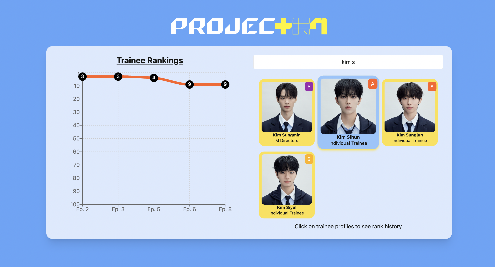
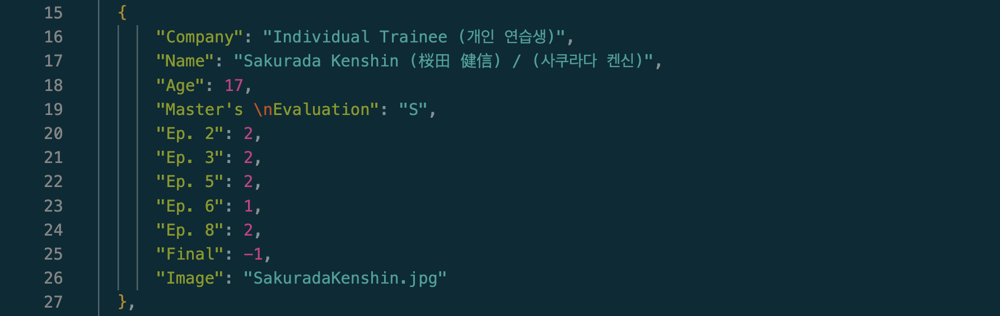

# Project 7 Ranking Charts

### Live Demo

You can view the live demo of the project here: [Project 7 Ranking Charts](https://project7-rankings.vercel.app/)

> Interactive chart for Project 7

## About this project

Employing React.js and Recharts, this website visualizes the rankings of the contestants of the show "Project 7" by engineering the data through processing Excel and csv files into visual charts.

### Key Features

- Line chart representing ranks per episode for each contestant
- Line chart can display all data at once, or one contestant at a time
- Contestant basic information is shown in the form of cards
- View the top 7 (potential pool of winners) for each episode

### Web Scraper Aspect

> Snippet of the JSON file generated by the web scraper

This repository contains a Python web scraper designed to extract contestant data from the Project 7 show's Wikipedia page and generate a JSON file export of the corresponding table.
